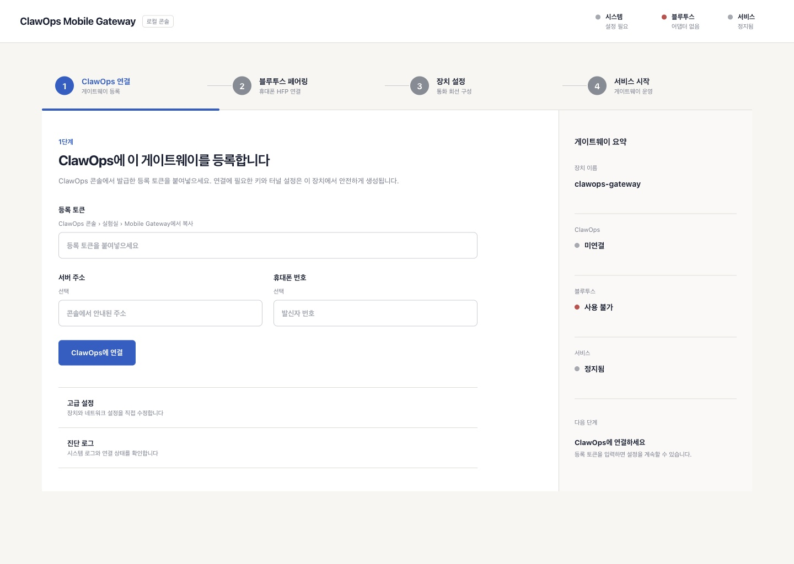
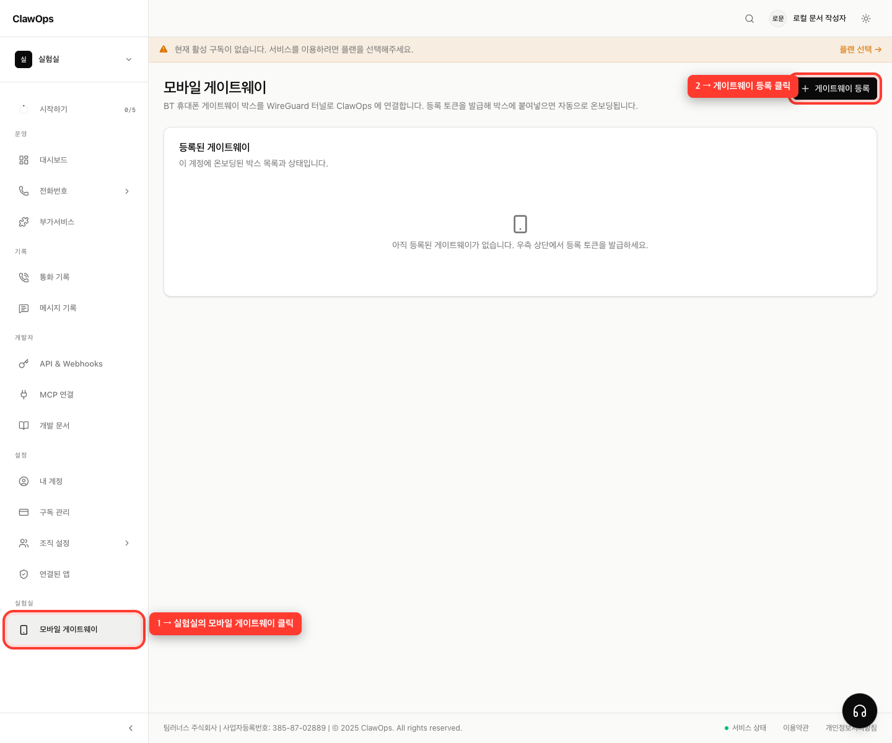
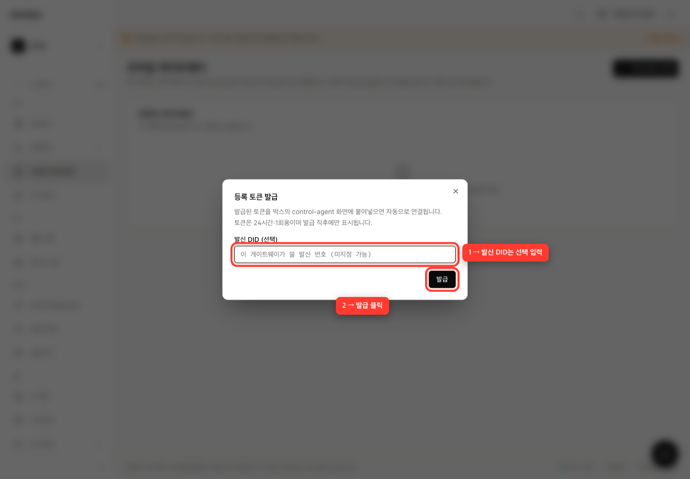
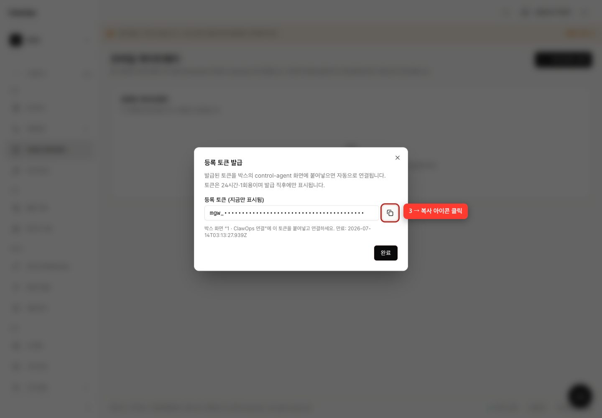
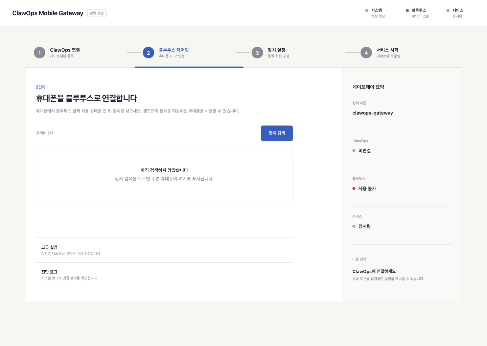
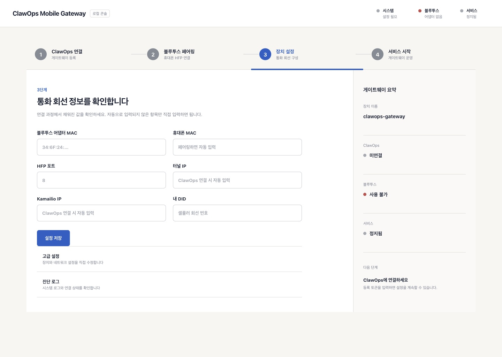
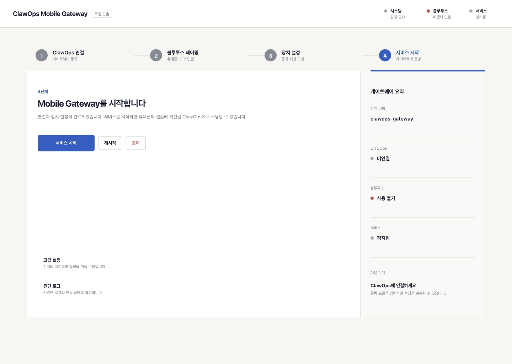

# ClawOps Mobile Gateway 설치 가이드

Bluetooth HFP(핸즈프리 통화)를 지원하는 휴대폰의 셀룰러 회선을 ClawOps에 연결하는 방법입니다.

## 준비물

- Ubuntu 22.04 또는 Debian 12 `amd64`/`arm64` 장비
- BlueZ 지원 USB 블루투스 어댑터
- Bluetooth HFP를 지원하고 셀룰러 통화가 가능한 휴대폰
- ClawOps 계정

## 1. 설치

게이트웨이 장비에서 다음 한 줄을 붙여넣고 실행합니다.

```bash
curl -fsSL https://raw.githubusercontent.com/learners-superpumped/clawops-mobile-gateway/main/scripts/install-release.sh | sudo sh
```

특정 버전을 설치하거나 롤백하려면 버전을 지정합니다.

```bash
curl -fsSL https://raw.githubusercontent.com/learners-superpumped/clawops-mobile-gateway/main/scripts/install-release.sh | sudo VERSION=0.1.0 sh
```

설치 상태를 확인합니다.

```bash
dpkg-query -W clawops-mobile-gateway
sudo systemctl status clawops-agent --no-pager
```

## 2. Mobile Gateway 화면 열기

같은 네트워크의 PC에서 다음 주소를 엽니다.

```text
http://<게이트웨이-IP>:8088
```



Web UI는 현재 인증이 없으므로 인터넷에 직접 공개하지 마세요.

## 3. ClawOps 등록 토큰 발급

1. [ClawOps 콘솔](https://platform.claw-ops.com)에 로그인합니다.
2. 왼쪽 위에서 게이트웨이를 등록할 조직을 확인합니다.
3. 왼쪽 드로어 아래의 **실험실 → 모바일 게이트웨이**를 누릅니다.
4. **게이트웨이 등록**을 누릅니다.



필요하면 **발신 DID**를 입력하고 **발급**을 누릅니다. SIM 번호는 이 입력란이 아니라 뒤의 Gateway 화면에 입력합니다.



발급된 토큰 오른쪽의 **복사 아이콘**을 누릅니다. 토큰은 24시간 동안 유효한 1회용 값입니다.



## 4. Gateway를 ClawOps에 연결

Mobile Gateway 상단의 **ClawOps 연결** 단계를 누르고 다음 값을 입력합니다.

| 입력란 | 값 |
|---|---|
| 등록 토큰 | ClawOps 콘솔에서 복사한 `mgw_...` 토큰 |
| 서버 주소 | `https://api.claw-ops.com` |
| 휴대폰 번호 | 연결할 셀룰러 회선 번호(선택) |

**ClawOps에 연결**을 누르고 우측 **게이트웨이 요약**에서 ClawOps 상태가 **연결됨**으로 바뀌는지 확인합니다.


## 5. 휴대폰 페어링

1. 휴대폰의 블루투스 설정을 열어 검색 가능한 상태로 둡니다.
2. 화면 상단의 **블루투스 페어링**을 누릅니다.
3. **장치 검색**을 누릅니다.
4. 휴대폰 이름과 MAC 주소를 확인하고 **페어링**을 누릅니다.
5. 휴대폰에 표시된 PIN을 승인합니다.
6. 버튼이 **페어링됨**으로 바뀌는지 확인합니다.



휴대폰 MAC 주소는 페어링 후 프로비저닝 화면에 자동으로 입력됩니다.

## 6. 프로비저닝과 시작

화면 상단의 **장치 설정**을 누르고 값을 확인합니다.

| 입력란 | 확인 방법 |
|---|---|
| 어댑터 MAC | `hciconfig hci0`의 `BD Address` |
| 휴대폰 MAC | 페어링 후 자동 입력 |
| HFP 포트 | `sdptool search --bdaddr <PHONE_MAC> HF`의 `Channel` |
| 터널 IP | ClawOps 연결 후 자동 입력 |
| Kamailio IP | ClawOps 연결 후 자동 입력 |
| 내 DID | 사용할 발신 번호 |

1. **설정 저장**을 누릅니다.
2. 화면 상단의 **서비스 시작**을 누릅니다.
3. **서비스 시작** 버튼을 누릅니다.
4. 우측 **게이트웨이 요약**에서 서비스가 **동작 중**으로 바뀌는지 확인합니다.





## 7. 정상 동작 확인

화면 상단과 우측 **게이트웨이 요약**에서 다음 상태를 확인합니다.

- 시스템: **정상**
- 블루투스: 연결한 휴대폰 표시
- ClawOps: **연결됨**
- 서비스: **동작 중**

문제가 있으면 화면 아래 로그 또는 다음 명령을 확인합니다.

```bash
sudo journalctl -u clawops-agent -n 100 --no-pager
sudo journalctl -u clawops-asterisk -n 100 --no-pager
```

ClawOps 콘솔의 **실험실 → 모바일 게이트웨이**를 새로고침해 상태가 **활성**인지 확인하면 설치가 끝납니다.
